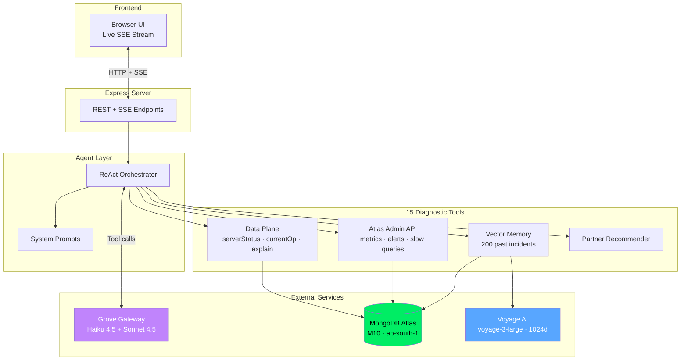

# 🛡️ Atlas Health Sentinel

> An agentic AI system that diagnoses MongoDB Atlas cluster health issues in real time — combining live cluster telemetry, institutional memory via vector search, and LLM-driven hypothesis refinement.

Built as a demonstration of how **agentic patterns + MongoDB primitives** can transform reactive ops into proactive, partner-flavored diagnostics.

---

## What it does

Sentinel watches a MongoDB Atlas cluster and, when prompted, behaves like a senior Principal Engineer:

1. **Forms hypotheses** about what might be wrong
2. **Picks diagnostic tools** dynamically (serverStatus, currentOp, $indexStats, explain plans, slow queries, replication status)
3. **Searches institutional memory** — past incidents stored as Voyage AI embeddings, retrieved via Atlas Vector Search
4. **Refines hypotheses** based on tool results
5. **Produces a structured diagnostic report** — severity, evidence, executable remediation, similar past incidents, confidence

All in **30-90 seconds**, streamed live to a browser UI.

---

## The 5 chaos scenarios

A built-in "Chaos Buffet" injects realistic, recoverable cluster pathologies for the agent to diagnose:

| Scenario | What it does | Past incident match |
|---|---|---|
| **COLLSCAN Avalanche** | Drops the `customer_id` index — workload starts full-collection-scanning | INC-2025-0061 |
| **Connection Storm** | Spawns 60 concurrent unbounded aggregations on a 1.2M doc collection | INC-2025-0094 |
| **Schema Rot** | Bloats 500 documents with 30,000-entry arrays (~3MB each) | INC-2025-0103 |
| **Replication Lag** | Hammers a single document with 1000 updates/sec (hot-doc anti-pattern) | INC-2025-0078 |
| **Working Set Breach** | Adds 1024-dim vector embeddings + builds a vector search index → working set exceeds RAM | INC-2025-0042 |

Each scenario is **fully reversible** via a Reset button.

---

## Architecture



### Why this stack

- **MongoDB Atlas (M10, ap-south-1)** — operational data, vector search index, Performance Advisor, Atlas Admin API
- **Grove** — MongoDB's internal GenAI gateway (Azure-backed Anthropic models, compliance-baked-in)
  - **Claude Haiku 4.5** for the tool-use loop (fast, accurate at structured tool calls)
  - **Claude Sonnet 4.5** for the final synthesis (polished JSON reports)
- **Voyage AI** (`voyage-3-large`, 1024-dim) — MongoDB's first-party embedding model for institutional memory
- **Express + SSE** — minimal server, real-time streaming of agent reasoning to the UI

### Why a two-tier model strategy

Tool use needs speed, not depth — the agent makes 8–12 LLM calls per diagnostic. Haiku 4.5 is purpose-built for fast, accurate tool selection. Sonnet 4.5 only handles the final synthesis where polished JSON output matters. **This cuts cost ~6× and latency ~3× with no visible quality loss** — the same pattern we'd recommend customers use in production agentic systems.

---

## Diagnostic tools the agent can call

| Tool | What it does |
|---|---|
| `get_server_status` | WiredTiger cache, connections, opcounters, network |
| `get_current_op` | In-progress ops + bucketed pattern detection (hot-doc detection) |
| `get_index_stats` | Index access counts and shapes via `$indexStats` |
| `get_coll_stats` | Storage/index sizes via `$collStats` |
| `explain_query` | Query planner output — IXSCAN vs COLLSCAN, examined-to-returned ratio |
| `sample_schema` | `$sample`-based field-shape detection (anti-pattern spotting) |
| `get_replication_status` | Primary/secondary lag |
| `get_write_activity` | Real-time ops/sec sampling (catches storms Atlas metrics lag on) |
| `get_cluster_metrics` | Atlas Admin API metrics (CPU, cache, query targeting) |
| `get_slow_queries` | Performance Advisor slow query log |
| `get_index_suggestions` | Performance Advisor index recommendations |
| `get_open_alerts` | Atlas open alerts |
| `search_similar_incidents` | Atlas Vector Search over 200 past incidents (Voyage embeddings) |
| `recommend_partner_solution` | Partner co-sell recommendation (suppressed in UI) |
| `find_oversized_documents` | Find largest documents by BSON size. Confirms unbounded array bloat that's invisible to random schema sampling. |

---

## Setup

### Prerequisites

- Node.js 20+
- MongoDB Atlas cluster (M10+, with Atlas Search enabled)
- Voyage AI API key
- Grove access (or any Anthropic-compatible LLM endpoint)

### 1. Clone and install

```bash
git clone https://github.com/sahil-doshi-mongodb/atlas-sentinel.git
cd atlas-sentinel
npm install
```

### 2. Configure environment

```bash
cp .env.example .env
# Then edit .env with your real credentials
```

### 3. Set up the cluster

```bash
node scripts/setup-cluster.js          # creates collections + indexes
node scripts/seed-load-data.js         # 1M synthetic orders
node scripts/seed-incidents.js         # 200 past incidents with embeddings
node scripts/create-vector-index.js    # creates Atlas Vector Search index (wait 1-2 min)
```

### 4. Run

In Terminal 1 — start the load generator:

```bash
node chaos/load-generator.js
```

In Terminal 2 — start the server:

```bash
node server.js
```

Open http://localhost:3000

---

## Demo flow

1. **Watch the dashboard** — live cluster metrics refresh every 5s
2. **Pick a scenario** from the Chaos Buffet (e.g. COLLSCAN Avalanche)
3. **Wait for the cooldown timer** — Diagnose button is automatically disabled while symptoms manifest (30-240s depending on scenario)
4. **Click "Diagnose Cluster"** when it unlocks — watch Sentinel reason through diagnostics live
5. **See the final report** — severity, evidence, executable remediation, similar past incidents, confidence
6. **Click "Reset All Chaos"** to clean up

### Scenario cooldowns

| Scenario | Cooldown |
|---|---|
| Schema Rot | 30s |
| COLLSCAN Avalanche | 60s |
| Connection Storm | 60s |
| Replication Lag | 120s |
| Working Set Breach | 240s |

---

### Demo safety: cooldown timer

To prevent premature diagnosis (which would miss symptoms that take time to manifest), the Diagnose button is automatically disabled after a chaos scenario is triggered. The button shows a live countdown and re-enables when the scenario's symptoms are ready to be observed.

This makes Sentinel **demo-bulletproof** — you can't accidentally run the agent before chaos has had time to take effect.

## Project structure

```
atlas-sentinel/
├── agent/        # ReAct orchestrator, LLM client, prompts
├── chaos/        # 5 chaos scenarios + load generator + workers
├── config/       # Mongo client setup
├── data/         # 200 seed past-incident records
├── public/       # UI (HTML + CSS + vanilla JS)
├── routes/       # Express routes (diagnose, chaos, cluster)
├── scripts/      # One-off setup + test scripts
├── tools/        # Diagnostic tool implementations + registry
└── server.js     # Express entry point
```

---

### Notes on the chaos architecture

- **Inline chaos** (`collscan_avalanche`, `schema_rot`) — synchronous state changes (drop index, bloat docs); reversible by reset
- **Worker chaos** (`connection_storm`, `replication_lag`, `working_set_breach`) — detached background processes that hammer the cluster continuously; PID-tracked for clean shutdown via SIGTERM → SIGKILL fallback

Worker chaos uses Node's `child_process.spawn(..., { detached: true })` pattern so the trigger script can return instantly while the chaos persists. Required for any scenario whose chaos behavior requires sustained activity, not just state changes.

## What this is NOT

- **Not a replacement** for Atlas Performance Advisor — it complements it by reasoning across signals
- **Not autonomous remediation** — Sentinel diagnoses and recommends, but never modifies the cluster
- **Not for production use as-is** — built as a partner-SA-flavored demonstration

---

## License

MIT

---

Built with 🛡️ by [Sahil Doshi](https://github.com/sahil-doshi-mongodb) — Senior Consulting Engineer, MongoDB
